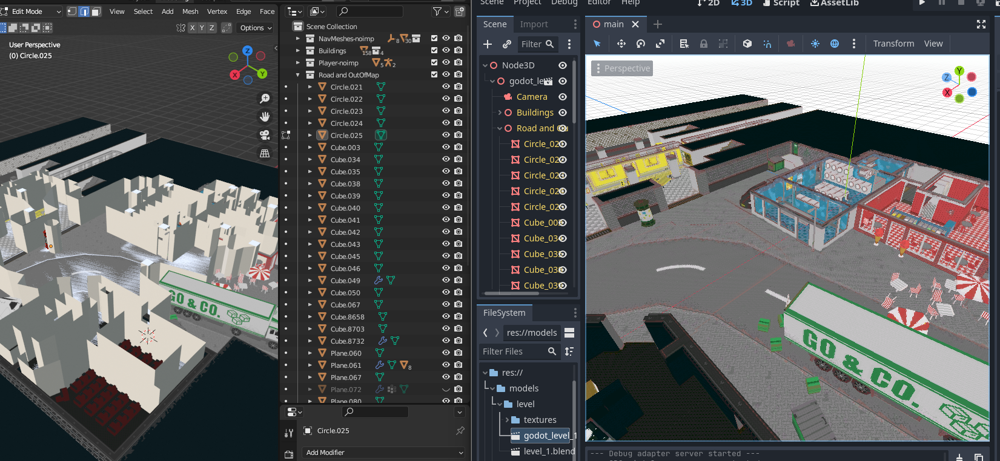

# DQBCTEGS
## DQ: Blender Collection To Empty Godot Saver

# What does this plugin do?
This plugin allows you to transer over blender collections (and their Godot-related flags) over to Godot.

- -noimp flag works with collections.
- you can use -imp flag on an object to negate a -noimp flag on a parent collection. -imp flag can also be chained with one more flag: -imp-colonly will always get imported with a -colonly flag

# Planned
- support for more flags
